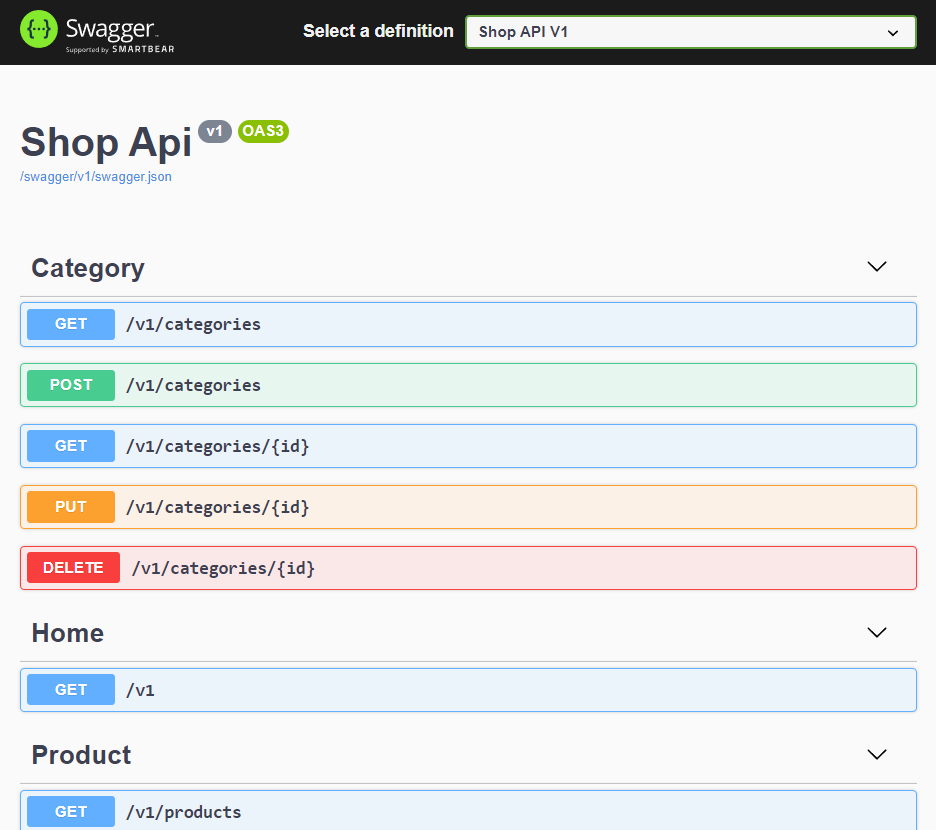
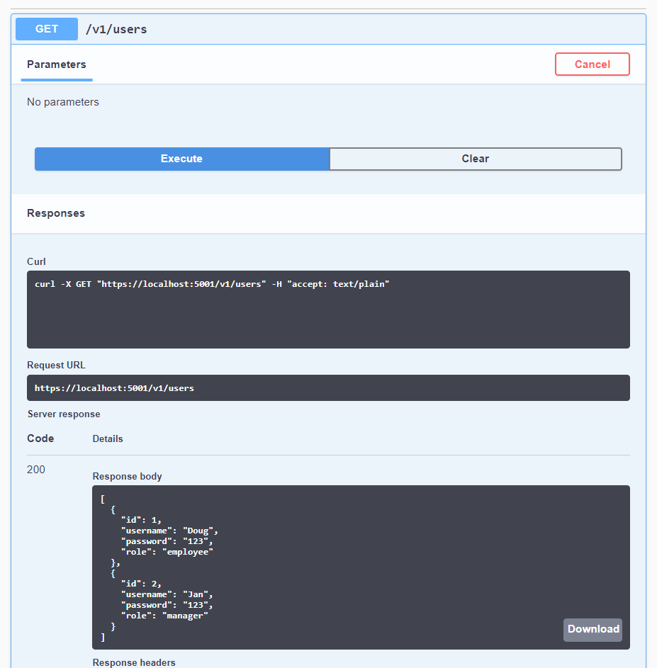

<h1 align="center">Shop Web API</h1>

 <a href="#-descrição">Descrição</a> •
 <a href="#-layout">Layout</a> • 
 <a href="#-tecnologias">Tecnologias</a> • 
 <a href="#-autor">Autor</a> • 
 <a href="#-licença">Licença</a>

## 📝 Descrição

A aplicação é uma Web API CRUD básica para cadastro de usuários, produtos e categorias. A sua implementação foi baseada no conceito de Data Driven, dentre outras coisas, uma base de Autenticação e Autorização com [JWT](https://jwt.io/introduction) e uma visualização da documentação com [Swagger](https://swagger.io/) foram desenvolvidas. O código foi produzido durante o curso **Criando APIs Data Driven com ASP.NET Core 3 e EF Core 3** orientado pelo professor [Balta.io](https://www.youtube.com/c/baltaio).

## 🎨 Layout

    
    

Disponibilizado pela ferramenta de automatização da documentação **Swagger**.

## 🚀 Tecnologias

As seguintes stacks foram usadas na construção do projeto:

+ **[Linguagem C#](https://docs.microsoft.com/pt-br/dotnet/csharp/)**
+ **[.NET v3.1](https://dotnet.microsoft.com/en-us/download/dotnet/6.0/)**
+ **[EFCore v3.1](https://docs.microsoft.com/pt-br/ef/)**
+ **[Swagger](https://swagger.io/)**

## 👨‍💻 Autor

Oi 👋, me chamo **Douglas**. Se precisar de algo, pode entrar em contato! 👇

  
  
  

  
  
  

  

## 📝 Licença

Este projeto esta sobe a licença MIT.  
Veja o arquivo [LICENSE](./LICENSE) para mais detalhes.

Feito com 💙 por <a href="https://www.linkedin.com/in/douglasmorais">Douglas Morais</a>.
 

